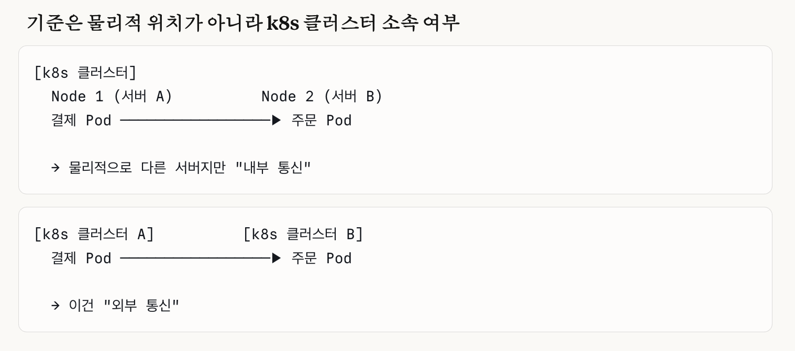
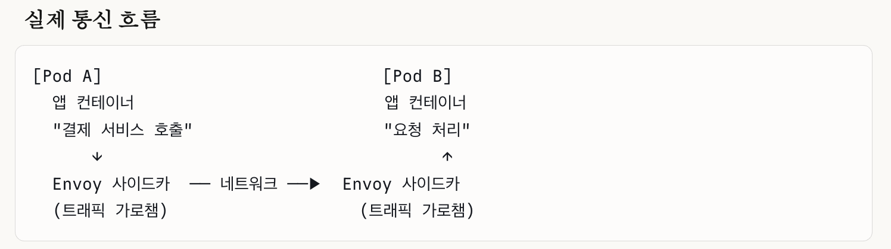

## Book
https://www.oreilly.com/library/view/cloud-native-devops/9781492040750/

Cloud Native DevOps with Kubernetes
by John Arundel, Justin Domingus
OREILLY, March 2019

### Reading
- 2026.02.01 - (WIP)

# Questions
#### 5.1.3 Resource Limits

Q. `Kubernetes allows resource overcommit. Overcommit means that the sum of all resource limits of containers in a node can exceed the total resources of that node. It is essentially a gamble.` --> Then it seems like only the `resources.requests` value is used to decide which node to place a pod on, and `limits` is not used for scheduling. Is `limits` only used for forcefully terminating pods?

A. It is correct that only `requests` values are used for scheduling. However, the role of `limits` is not limited to forced termination. The behavior differs between CPU and memory.
- **When CPU limits are exceeded**: The pod is not terminated but **throttled**. The CFS (Completely Fair Scheduler) restricts CPU usage time, so the pod simply slows down.
- **When memory limits are exceeded**: The OOM Killer kicks in and the container is **forcefully terminated**.

Additionally, the combination of `requests` and `limits` settings determines the pod's **QoS (Quality of Service) class**.
- **Guaranteed** (all containers have requests = limits): Last to be evicted when the node runs low on resources
- **Burstable** (requests < limits, or only partially set): Medium priority
- **BestEffort** (neither requests nor limits are set): First to be evicted

When a node experiences resource pressure (node pressure), the kubelet decides which pods to evict first based on their QoS class.

In summary, `limits` is used for three purposes: (1) CPU throttling, (2) OOM Kill when memory is exceeded, and (3) eviction priority through QoS class determination.

#### 9.7 Istio

Q. What Istio manages: it's basically responsible for internal communication, but it has multi-cluster capabilities that let you connect multiple k8s clusters into a single Istio mesh. So what exactly does "internal communication" mean here?

A. It means communication between pods within a single k8s cluster. In other words, even if pods are placed on different nodes, as long as those nodes belong to a single k8s cluster, pod-to-pod communication is considered internal. Physical distance or server location doesn't matter.



Q. What is Istio's overall role?

A. All of this is made possible by injecting an Envoy proxy sidecar into each pod.

```
Traffic Management

Load balancing for requests between services
Traffic splitting for deployment strategies like canary/blue-green
Automatic retry and timeout handling
Circuit breaker to prevent failure propagation

Security

Automatic mTLS encryption for service-to-service communication
Automatic certificate issuance and renewal
Access control for "which service can call which service" (Authorization Policy)
JWT-based user authentication

Observability

Automatic metric collection for all requests between services (response time, error rate, traffic volume, etc.)
Automatic distributed tracing generation (tracking which services a request passed through)
Automatic access log collection
Integration with monitoring tools like Prometheus, Grafana, and Jaeger

Policy Management

Centrally manage network policies as YAML, not code
Apply the same policies to all services regardless of language or framework
Change policies without redeploying services
```



#### 12.1.4 Handling Quotes in Templates

Q. What is the `quote` function and why is it needed?

A. `quote` is a Helm template function that wraps a value in double quotes (`"`). Since YAML parsing can break when string values contain special characters, using `{{ .Values.MyName | quote }}` produces `"John Doe"` which is safely treated as a string. However, using `quote` on numeric values like port numbers turns `8080` into `"8080"` (a string), which causes Kubernetes errors. So it should only be used on string values.

#### 12.4 Advanced Manifest Management Tools

Q. Is Ansible at the same level as Helm?

A. No. They manage different scopes. **Helm** is a tool for packaging and deploying applications within Kubernetes. **Ansible** is a tool for managing entire infrastructure — server setup, software installation, infrastructure provisioning, etc. It is common to use Ansible to set up a Kubernetes cluster, then use Helm to deploy applications on top of it. In other words, Ansible operates at the infrastructure level, while Helm operates at the Kubernetes level.

# Newly Learned

- It is best to keep container images as small as possible. The reasons are: smaller containers build faster, take up less image storage space, pull faster, and have fewer security vulnerabilities. - 5.1.4 Keep Your Containers Small
- There are commands that can wipe out all resources under a namespace. In the current version of Kubernetes, there is **no way to protect resources like namespaces from being deleted** (however, this feature is being discussed on the Kubernetes GitHub issues page). - 5.3.2 Which Namespaces Should I Use?
  - Still nothing!

- Service resources provide permanent IP addresses and DNS addresses that are automatically routed to pods. Service DNS names always follow this format: `SERVICE.NAMESPACE.svc.cluster.local`
  - `.svc.cluster.local` is optional, and the namespace is also optional. If you want to communicate with a `demo` service in the `prod` namespace, you can use: `prod.demo` - 5.3.3 Service Addresses
- You can also choose the type of nodes in a cluster (e.g., GPU-enabled nodes) and scale them up/down.
- Because Kubernetes can be configured in so many ways, it has a set of tests to verify that a cluster meets the core requirements for a specific version and is conformant. There are official certifications, as well as tools for running your own conformance tests. - 6.2 Conformance Checking
- `kubectl get pods --watch` — you can use the watch option. This seems useful in corporate environments where using external open-source tools like kubespy is frowned upon! (I'm actually using Lens, but this looks more fun.) - 7.1.9 Watching Objects
- Imperative commands are useful for quick tests or validating ideas, but they have the problem of lacking a reliable single source of truth. With imperative commands, there is no way to know when or who ran them, or what the results were. - 7.2.2 When Not to Use Imperative Commands
  - TIP) In production clusters, you should not use imperative `kubectl` commands like `create` or `edit`. It is recommended to manage resources with version-controlled YAML manifests and apply them with `kubectl apply` (or Helm charts).
- (Obviously) containers within a pod communicate locally with each other. In other words, containers in the same pod are always located on the same physical machine.
- A container image can have multiple tags, but its digest is unique. - 8.2.3 Container Digests
- Running a container's program as the root user should be avoided. There are security options such as `runAsNonRoot: true`, `readOnlyRootFilesystem: true`, and `allowPrivilegeEscalation: false`. You can run a container as a specific UID user with `securityContext.runAsUser`. - 8.3.1 Running Containers as a Non-Root User
- You can use a DaemonSet to run exactly one container per node (not duplicated per pod). However, since you can't control the number of replicas, it's best used when a single replica per node is all you need. - 9.5.1 DaemonSets
- Job: runs pods only the specified number of times, and considers the task complete once they've run. - 9.5.3 Jobs
- Two elements responsible for routing:
  - Ingress: routes external traffic to the appropriate microservice
  - Service: routes internal traffic (e.g., communication between microservices)
- Once access permissions are granted to a K8s user, they cannot be revoked (!) - 11.1.4 Binding Roles to Users
  - `cluster-admin` is the K8s equivalent of Linux's `root`. Don't give this permission to service accounts for externally exposed applications!! The `edit` role is more than enough for deployment purposes.
- Node pod placement settings
  - Node affinity: specifies which nodes a pod should be scheduled on
  - Pod affinity/pod anti-affinity: determines how new pods are scheduled based on existing pods on nodes
  - Taints/tolerations: specifies what kinds of pods a node will accept
- **Jsonnet**: A data templating language that extends JSON. It adds programming features like variables, loops, conditionals, and functions to JSON. It ultimately outputs JSON but allows managing repetitive Kubernetes YAML much more concisely. Tools like ksonnet and kapitan are based on Jsonnet. - 12.4 Advanced Manifest Management Tools
  ```jsonnet
  local makeDeployment(name, image, replicas=1) = {
    apiVersion: "apps/v1",
    kind: "Deployment",
    metadata: { name: name },
    spec: { replicas: replicas },
  };
  // Create deployments with a simple function call
  { web: makeDeployment("web", "nginx", 3) }
  ```
- Useful monitoring patterns - 16.2 Choosing Good Metrics
  - Key metrics for services = RED pattern: measure Request rate, Error rate, and Duration. For Request and Error, it's better to measure rates rather than raw totals (e.g., requests per second). This allows top-down observation of service performance and user experience.
  - Key metrics for resources = USE pattern: measure Utilization, Saturation, and Errors. This helps analyze performance issues and identify bottlenecks in a bottom-up manner.
  - Don't forget to log business-critical data directly!
